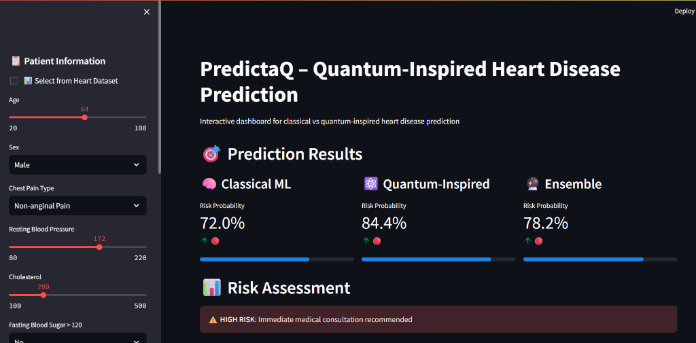
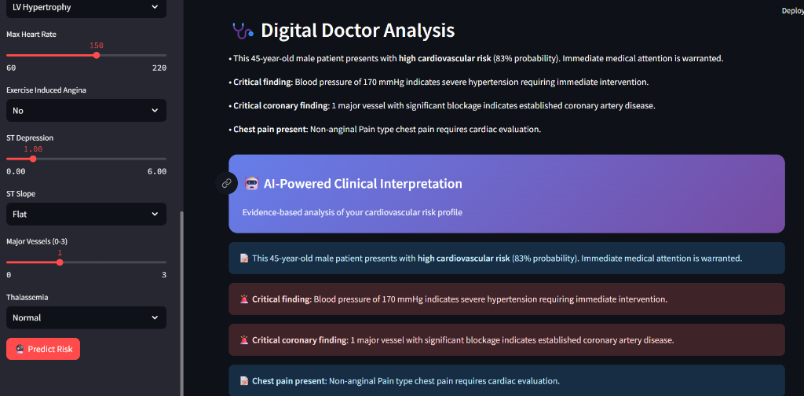

# 🫀 PredictaQ — Quantum-Inspired Heart Disease Prediction

> A multi-phase machine learning pipeline combining classical ensemble models with a **Variational Quantum Circuit (VQC)** for heart disease risk prediction, served through an interactive **Streamlit** dashboard.

---

## 📌 Overview

PredictaQ is a research-oriented ML project that explores the frontier of **quantum-classical hybrid machine learning** applied to medical data. It trains and compares multiple classical models alongside a PennyLane-based quantum neural network, then unifies predictions through a stacking ensemble.

The interactive web app lets users enter patient vitals and instantly receive risk scores from both classical and quantum-inspired pipelines.

---

## ✨ Features

- 🧠 **Classical ML Models** — Logistic Regression, Random Forest, SVM
- ⚛️ **Variational Quantum Circuit (VQC)** — Built with PennyLane + PyTorch, using RY/RZ rotations and CNOT entanglement gates
- 🤖 **Hybrid Stacking Ensemble** — RF, XGBoost, LightGBM, Gradient Boosting, SVM, LR combined via a meta-learner
- 📊 **Interactive Streamlit Dashboard** — Real-time patient risk prediction with visualizations
- 🔬 **Quantum-Inspired Scoring** — Interference and superposition effects applied to classical probabilities
- 📁 **Dataset Explorer** — Select directly from the UCI Heart Disease dataset
- 🩺 **Digital Doctor Insights** — Automated clinical evaluation and evidence-based cardiac recommendations

---

## 📸 Application Preview

### 🔮 Interactive Risk Prediction Dashboard
> Compare Classical ML, Quantum-Inspired, and Hybrid Ensemble risk probabilities side-by-side:


### 🩺 AI-Powered Digital Doctor & Clinical Insights
> Automated risk interpretation highlighting critical findings and clinical recommendations:


---

## 🗂️ Project Structure

```
PredictaQ/
├── app/
│   └── app.py                  # Streamlit web application
├── assets/
│   ├── dashboard_prediction_results.png
│   └── digital_doctor_analysis.png
├── data/
│   ├── heart.csv               # UCI Heart Disease dataset (303 patients, 13 features)
│   ├── X_scaled.csv            # Preprocessed feature matrix (StandardScaler)
│   └── y.csv                   # Target labels (0 = no disease, 1 = disease)
├── models/
│   ├── logistic_regression_model.pkl
│   ├── random_forest_model.pkl
│   ├── svm_model.pkl
│   ├── hybrid_vqc_model_best.pth   # Best VQC checkpoint (PyTorch)
│   ├── meta_model.pkl              # Stacking meta-learner
│   ├── voting_ensemble.pkl         # Soft-voting ensemble
│   ├── preprocessing.pkl           # Feature weights + names
│   └── random_forest_feature_importance.csv
├── evaluate_models.py          # Standalone model benchmark & evaluation script
├── phase1_data_prep.py         # Data loading, scaling, and export
├── phase2_classical_ml.py      # Train LR, RF, and SVM classifiers
├── phase3_vqc_torch.py         # Train hybrid VQC model (PennyLane + PyTorch)
├── phase4_hybrid.py            # Train advanced stacking ensemble
├── requirements.txt
├── .gitignore
└── README.md
```

---

## 🧬 Dataset

The project uses the **UCI Heart Disease Dataset** (`heart.csv`) with **303 patient records** and **13 clinical features**:

| Feature | Description |
|---------|-------------|
| `age` | Age in years |
| `sex` | Sex (1 = male, 0 = female) |
| `cp` | Chest pain type (0–3) |
| `trestbps` | Resting blood pressure (mm Hg) |
| `chol` | Serum cholesterol (mg/dl) |
| `fbs` | Fasting blood sugar > 120 mg/dl (1 = true) |
| `restecg` | Resting ECG results (0–2) |
| `thalach` | Maximum heart rate achieved |
| `exang` | Exercise induced angina (1 = yes) |
| `oldpeak` | ST depression induced by exercise |
| `slope` | Slope of peak exercise ST segment |
| `ca` | Number of major vessels colored by fluoroscopy |
| `thal` | Thalassemia type |
| `target` | **Heart disease present** (1 = yes, 0 = no) |

---

## 🚀 Getting Started

### 1. Clone the Repository

```bash
git clone https://github.com/your-username/PredictaQ.git
cd PredictaQ
```

### 2. Set Up a Virtual Environment

```bash
python -m venv venv
.\venv\Scripts\activate       # Windows
# source venv/bin/activate    # macOS/Linux
```

### 3. Install Dependencies

```bash
pip install -r requirements.txt
pip install streamlit plotly
```

---

## ⚙️ Training Pipeline

Run each phase **in order**. Pre-trained models are already saved in `models/`, so you can skip to Step 5 if you just want to use the app.

### Phase 1 — Data Preparation
```bash
python phase1_data_prep.py
```
Loads `heart.csv`, applies `StandardScaler`, and saves `X_scaled.csv` + `y.csv`.

### Phase 2 — Classical ML Training
```bash
python phase2_classical_ml.py
```
Trains **Logistic Regression**, **Random Forest** (100 trees), and **SVM (RBF kernel)**. Saves models to `models/`.

### Phase 3 — Quantum VQC Training
```bash
python phase3_vqc_torch.py
```
Trains a **Hybrid Classical-Quantum Neural Network** using PennyLane and PyTorch:
- **Pre-processing layers**: Linear → ReLU → Dropout
- **Quantum layer**: RY/RZ rotations + CNOT entanglement (3 layers, n_qubits = 13)
- **Post-quantum layers**: Linear → ReLU → Dropout → Output
- Optimizer: Adam with AmsGrad + ReduceLROnPlateau scheduler
- Best model saved by validation accuracy over 25 epochs.

### Phase 4 — Hybrid Ensemble Training
```bash
python phase4_hybrid.py
```
Trains an advanced **stacking ensemble**:
- Base learners: RF, XGBoost, LightGBM, Gradient Boosting, SVM, LR
- Meta-learner: Logistic Regression trained on out-of-fold predictions (5-fold CV)
- Also trains a **soft-voting ensemble** and **weighted probability ensemble**
- Best strategy selected automatically by test accuracy.

### 📊 Model Evaluation & Benchmarks
To evaluate all pre-trained models on the test set without retraining:
```bash
python evaluate_models.py
```

| Model | Accuracy | Precision | Recall | F1-Score | ROC-AUC |
|---|---|---|---|---|---|
| **Random Forest** | **98.54%** | **100.00%** | **97.09%** | **98.52%** | **1.0000** |
| **Support Vector Machine (SVM)** | 88.78% | 85.09% | 94.17% | 89.40% | 0.9603 |
| **Logistic Regression** | 79.51% | 75.63% | 87.38% | 81.08% | 0.8790 |

---

## 🖥️ Running the Web App

```bash
cd app
streamlit run app.py
```

Open your browser at **http://localhost:8501**.

**App Features:**
- 📋 Enter patient vitals manually via sidebar sliders/dropdowns
- 📊 Or select any patient directly from the heart dataset
- 🔮 Click **Predict Risk** to see:
  - Classical model probability (Random Forest + Logistic Regression)
  - Quantum-inspired risk score with interference effects
  - Risk gauge visualization (Plotly)

> **Note:** The app automatically falls back to a synthetic dataset if `heart.csv` is not found, so it works out-of-the-box.

---

## 🧪 Model Architecture (VQC)

```
Input (13 features)
    │
    ▼
[Linear(13→64) → ReLU → Dropout(0.2)]
    │
    ▼
[Linear(64→13) → ReLU]
    │
    ▼
⚛️  Quantum Layer (PennyLane)
    ├── Encode: RY(xᵢ), RZ(xᵢ) for each qubit
    ├── Parameterized: RY(θ), RZ(θ) × 3 layers
    ├── Entangle: CNOT chain
    └── Measure: ⟨Z⟩ for each qubit
    │
    ▼
[Linear(13→32) → ReLU → Dropout(0.2)]
    │
    ▼
[Linear(32→1)]  →  BCEWithLogitsLoss
```

---

## 📦 Dependencies

| Package | Version | Purpose |
|---------|---------|---------|
| `numpy` | 1.23.5 | Numerical computing |
| `pandas` | 1.5.3 | Data manipulation |
| `scikit-learn` | 1.3.0 | Classical ML models |
| `torch` | 2.0.1 | Deep learning (VQC backend) |
| `pennylane` | 0.29.1 | Quantum circuit simulation |
| `autoray` | 0.6.1 | Array backend abstraction |
| `xgboost` | 2.0.0 | Gradient boosting |
| `lightgbm` | 4.0.0 | Fast gradient boosting |
| `joblib` | 1.3.2 | Model serialization |
| `streamlit` | 1.28.0 | Web dashboard |
| `plotly` | 5.17.0 | Interactive visualizations |

---

## 🤝 Contributing

Pull requests are welcome! If you'd like to improve the VQC architecture, add new models, or enhance the UI, feel free to open an issue first to discuss your ideas.

---

## 📄 License

This project is for educational and research purposes. Dataset sourced from the [UCI Machine Learning Repository](https://archive.ics.uci.edu/dataset/45/heart+disease).

---

<p align="center">Made with ❤️ and ⚛️ by Sahana</p>
